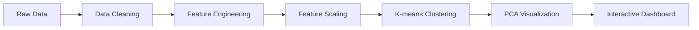
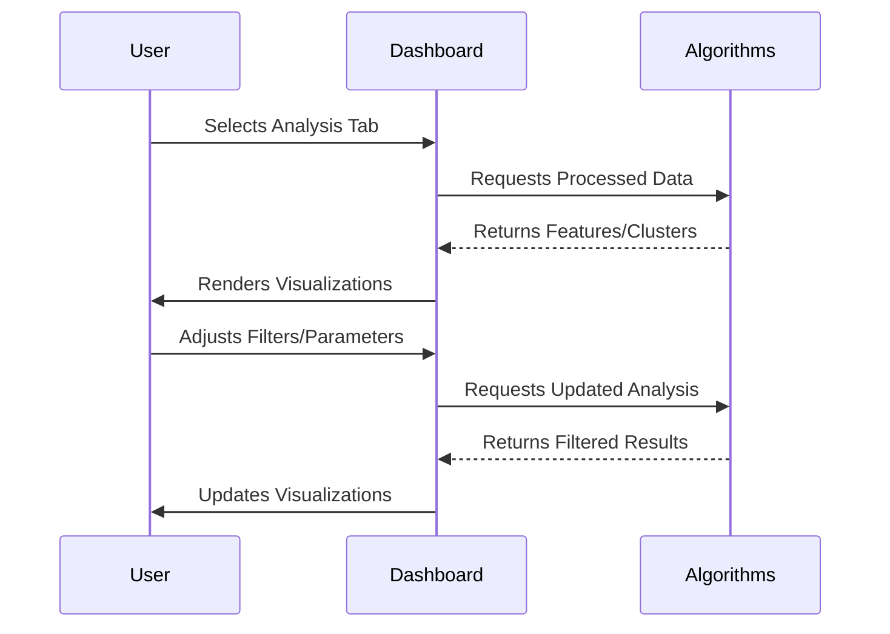

# 📊 E-commerce Customer Behavior Analysis Dashboard

[](https://dash.plotly.com/)
[](LICENSE)
[](https://github.com/Rakshak-D/ecommerce-customer-analysis/issues)

A comprehensive dashboard for analyzing e-commerce customer behavior patterns, identifying high-value segments, and developing retention strategies through interactive visualizations and machine learning clustering.


---

## ✨ Key Features

### 📊 Interactive Dashboard
- Real-time metrics visualization (total customers, average spend, purchase patterns)
- Membership type distribution analysis
- Total spend histogram with dynamic binning
- Cluster analysis visualization with PCA reduction

### 🔍 Data Exploration
- Full dataset browser with pagination
- Dynamic feature selection for distribution analysis
- Interactive histograms for numerical features
- Responsive data tables with sorting capabilities

### 👥 Customer Segmentation
- K-means clustering based on spending behavior
- PCA visualization for high-dimensional data
- Cluster statistics comparison (average spend, items purchased)
- Hover details for individual customer analysis

### ⚠️ Churn Analysis
- Churn risk identification (30+ days since last purchase)
- Membership type breakdown of churn risk
- Multi-select filtering by membership type
- Visual comparison of at-risk customers

### 💡 Actionable Recommendations
- Data-driven business strategy suggestions
- Retention tactics for high-value customers
- Marketing optimization for key demographics
- Personalized engagement strategies

---

## 🚀 Quick Start

### Prerequisites
- Python 3.8+
- Pip package manager

```bash
# Clone repository
git clone https://github.com/Rakshak-D/ecommerce-customer-analysis.git
cd ecommerce-customer-analysis

# Install dependencies
pip install -r requirements.txt

# Run the application
python app.py
```

**Access the Dashboard:**  
🌐 `http://localhost:8050/`

**Navigation Endpoints:**
- Main Dashboard: `/`
- Data Exploration: `/data-exploration`
- Customer Segmentation: `/segmentation`
- Churn Analysis: `/churn`
- Business Recommendations: `/recommendations`

---

## 📊 Data Pipeline

### Processing Workflow


### Analysis Flow


---

## 🛠 Technology Stack

| Component               | Technologies                                |
|-------------------------|--------------------------------------------|
| **Frontend**            | Dash, Plotly, HTML5, CSS3                  |
| **Backend**             | Python 3.8, Dash Callbacks                 |
| **Data Processing**     | Pandas, NumPy, Scikit-learn                |
| **Machine Learning**    | K-means Clustering, PCA                    |
| **Visualization**       | Plotly Express, Histograms, Scatter Plots  |
| **Styling**             | Custom CSS, Responsive Design              |

---

## 📂 Repository Structure

```
ecommerce-customer-analysis/
├── app.py                 # Main application entry point
├── assets/                # Static assets
│   └── custom.css         # Custom stylesheet
├── data/                  # Dataset storage
│   └── E-commerce Customer Behavior.xlsx  # Primary dataset
├── LICENSE                # MIT License
├── README.md              # Project documentation
└── requirements.txt       # Python dependencies
```

---

## 📝 Core Dependencies

```text
dash==2.18.1             # Web application framework
pandas==2.2.3            # Data manipulation and analysis
numpy==2.1.1             # Numerical operations
scikit-learn==1.5.2      # Machine learning algorithms
plotly==5.24.1           # Interactive visualizations
openpyxl==3.1.5          # Excel file handling
```

---

## 🔍 Key Insights from Analysis

1. **Customer Segmentation**:
   - Identified 3 distinct customer clusters based on spending behavior
   - High-value cluster shows 2.3x higher average spend than others
   - Frequent buyers cluster maintains consistent purchase patterns

2. **Churn Risk**:
   - 32% of customers show high churn risk (30+ days since last purchase)
   - Premium members have 40% lower churn risk than basic members
   - High-value customers show strongest retention patterns

3. **Demographic Patterns**:
   - 31-40 age group represents 45% of high-value customers
   - Customers in 41-50 age group show highest spend per item
   - 20-30 age group has highest purchase frequency

---

## 📈 Business Recommendations

1. **Retention Strategies**:
   - Implement loyalty programs for high-value customers
   - Create win-back campaigns for at-risk segments
   - Develop personalized offers based on cluster behavior

2. **Marketing Optimization**:
   - Target 31-40 age group with premium product promotions
   - Bundle popular items for frequent buyers
   - Create urgency campaigns for basic members showing churn risk

3. **Product Development**:
   - Analyze high-value customer preferences for new offerings
   - Develop subscription models for frequent purchase items
   - Create tiered membership benefits based on spending levels

---

## 🐛 Issue Reporting

[](https://github.com/Rakshak-D/ecommerce-customer-analysis/issues)

**Bug Report Template:**
```markdown
## Description
[Clear explanation of the issue]

## Reproduction Steps
1. Navigate to...
2. Click on...
3. Observe...

**Expected Behavior**  
[Expected outcome]

**Actual Behavior**  
[Actual outcome]

**Environment**  
- OS: [e.g., Windows 11]
- Browser: [e.g., Chrome 125]
- Python Version: [e.g., 3.10]

**Additional Context**  
[Screenshots/Error Messages]
```

---

## 📜 License

This project is licensed under the MIT License - see [LICENSE](LICENSE) for complete terms.

---

## 📬 Contact & Support

**Project Maintainer**  
Rakshak D  
📧 rakshakmce@gmail.com  
🔗 [GitHub Profile](https://github.com/Rakshak-D)  

**Repository**  
[https://github.com/Rakshak-D/ecommerce-customer-analysis](https://github.com/Rakshak-D/ecommerce-customer-analysis)

---

## 🚧 Future Enhancements

### Planned Features
- 🧠 Predictive churn modeling
- 📈 Customer lifetime value estimation
- 🔄 Automated report generation
- 🌐 Multi-dataset comparison
- 🔔 Alert system for critical metrics

### Contribution Guide
1. Fork the repository
2. Create your feature branch (`git checkout -b feature/amazing-feature`)
3. Commit your changes (`git commit -m 'Add amazing feature'`)
4. Push to the branch (`git push origin feature/amazing-feature`)
5. Open a pull request

**Development Standards**:
- Follow PEP8 coding conventions
- Maintain comprehensive docstrings
- Add tests for new functionality
- Update documentation with changes
